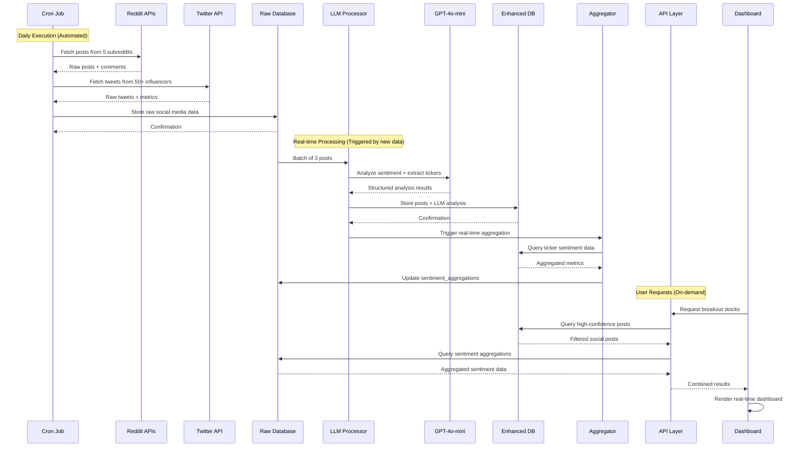

# Social Media Post Extraction and Sentiment Analysis Architecture

## Overview

The Investing Dashboard implements a comprehensive real-time social media sentiment analysis system that extracts posts from Reddit and Twitter, processes them through Large Language Models (LLMs), and provides actionable financial insights through an interactive dashboard.

## System Architecture

### High-Level Overview
```
┌─────────────────┐    ┌─────────────────┐    ┌─────────────────┐    ┌─────────────────┐
│   Data Sources  │    │   Extraction    │    │   Processing    │    │  Visualization  │
│                 │    │                 │    │                 │    │                 │
│  • Reddit RSS   │───▶│  • Cron Jobs    │───▶│  • LLM Analysis │───▶│  • Dashboard    │
│  • Twitter API  │    │  • Rate Limiting│    │  • Real-time    │    │  • Charts       │
│  • Influencers  │    │  • Data Cleanup │    │  • Aggregation  │    │  • Filters      │
└─────────────────┘    └─────────────────┘    └─────────────────┘    └─────────────────┘
```

### Detailed Process Flow

```mermaid
graph TB
    %% Data Sources
    subgraph "Data Sources"
        RS[Reddit RSS API<br/>5 Subreddits]
        RJ[Reddit JSON API<br/>Comments]
        TW[TwitterAPI.io<br/>50+ Influencers]
    end

    %% Cron Job Orchestration
    subgraph "Cron Job Orchestration"
        CRON[Daily Cron Job<br/>route.ts]
        AUTH[Bearer Token Auth]
        RATE[Rate Limiting<br/>1s delays]
    end

    %% Raw Data Storage
    subgraph "Raw Data Storage"
        TRT[twitter_posts_raw<br/>Basic columns only]
        RRT[reddit_posts_raw<br/>Basic columns only]
        RRC[reddit_comments_raw]
    end

    %% LLM Processing Pipeline
    subgraph "LLM Processing Pipeline"
        ELI[Enhanced LLM Ingestion<br/>enhanced-llm-ingestion.ts]
        LPP[LLM Post Processor<br/>llm-post-processor.ts]
        GPT[GPT-4o-mini<br/>OpenAI Chat API]
        BATCH[Batch Processing<br/>3 posts per batch]
    end

    %% Analysis Results
    subgraph "LLM Analysis Results"
        TICK[Ticker Extraction<br/>AAPL, TSLA, etc.]
        SENT[Sentiment Score<br/>-1 to +1]
        CONF[Confidence Score<br/>0 to 1]
        THEME[Key Themes<br/>earnings, merger]
        ACTION[Actionability<br/>0 to 1]
        CATAL[Catalyst Detection<br/>true/false]
    end

    %% Enhanced Storage
    subgraph "Enhanced Data Storage"
        TRTE[twitter_posts_raw<br/>+ LLM columns]
        RRTE[reddit_posts_raw<br/>+ LLM columns]
    end

    %% Real-time Aggregation
    subgraph "Real-time Aggregation"
        RTA[Real-time Aggregator<br/>real-time-aggregator.ts]
        FUNC[update_sentiment_aggregation_for_ticker()]
        AGG[sentiment_aggregations<br/>table]
    end

    %% API Layer
    subgraph "API Layer"
        SPA[Social Posts API<br/>/api/social-posts]
        SDA[Sentiment Data API<br/>/api/sentiment-data]
        FILTER[Multi-source Filtering<br/>Confidence, Sentiment, Time]
    end

    %% Frontend Visualization
    subgraph "Frontend Dashboard"
        BSA[Breakout Stocks<br/>Analysis]
        HC[Historical Charts]
        CFD[Comprehensive<br/>Dashboard]
        RT[Real-time Updates]
    end

    %% Data Flow Connections
    RS --> CRON
    RJ --> CRON
    TW --> CRON
    
    CRON --> AUTH
    AUTH --> RATE
    
    RATE --> TRT
    RATE --> RRT
    RATE --> RRC
    
    TRT --> ELI
    RRT --> ELI
    
    ELI --> LPP
    LPP --> BATCH
    BATCH --> GPT
    
    GPT --> TICK
    GPT --> SENT
    GPT --> CONF
    GPT --> THEME
    GPT --> ACTION
    GPT --> CATAL
    
    TICK --> TRTE
    SENT --> TRTE
    CONF --> TRTE
    THEME --> TRTE
    ACTION --> TRTE
    CATAL --> TRTE
    
    TICK --> RRTE
    SENT --> RRTE
    CONF --> RRTE
    THEME --> RRTE
    ACTION --> RRTE
    CATAL --> RRTE
    
    TRTE --> RTA
    RRTE --> RTA
    RTA --> FUNC
    FUNC --> AGG
    
    TRTE --> SPA
    RRTE --> SPA
    AGG --> SDA
    
    SPA --> FILTER
    SDA --> FILTER
    
    FILTER --> BSA
    FILTER --> HC
    FILTER --> CFD
    
    BSA --> RT
    HC --> RT
    CFD --> RT

    %% Styling
    classDef dataSource fill:#e1f5fe
    classDef processing fill:#f3e5f5
    classDef storage fill:#e8f5e8
    classDef api fill:#fff3e0
    classDef frontend fill:#fce4ec

    class RS,RJ,TW dataSource
    class CRON,AUTH,RATE,ELI,LPP,GPT,BATCH processing
    class TRT,RRT,RRC,TRTE,RRTE,AGG storage
    class SPA,SDA,FILTER api
    class BSA,HC,CFD,RT frontend
```

## Core Components

### 1. Data Ingestion Layer

#### Reddit Data Collection
- **Source**: Reddit RSS API + JSON API
- **Implementation**: `src/lib/reddit-rss.ts`
- **Targets**: 
  - Subreddits: `wallstreetbets`, `investing`, `stocks`, `StockMarket`, `ValueInvesting`
  - Posts: Top posts with metadata (score, comments, author, etc.)
  - Comments: Nested comment extraction for high-engagement posts

#### Twitter Data Collection
- **Source**: TwitterAPI.io (third-party service)
- **Implementation**: `src/lib/twitter-api.ts`
- **Targets**:
  - 50+ Financial influencers (Jim Cramer, Cathie Wood, etc.)
  - Real-time tweets with engagement metrics
  - Hashtags and cashtags extraction

#### Cron Job Orchestration
- **Implementation**: `src/app/api/cron/sentiment-data/route.ts`
- **Schedule**: Daily automated execution
- **Authentication**: Bearer token security
- **Rate Limiting**: Respectful API usage with delays

### 2. LLM Processing Pipeline

#### Enhanced LLM Ingestion
- **Implementation**: `src/lib/enhanced-llm-ingestion.ts`
- **Model**: GPT-4o-mini via OpenAI Chat Completions API
- **Batch Processing**: 3 posts per batch to prevent response truncation
- **Real-time Integration**: Immediate aggregation after processing

#### Post Processing Engine
- **Implementation**: `src/lib/llm-post-processor.ts`
- **Features**:
  - **Ticker Extraction**: Identifies stock symbols mentioned
  - **Sentiment Analysis**: -1 (bearish) to +1 (bullish) scoring
  - **Confidence Scoring**: 0-1 reliability metric
  - **Theme Extraction**: Key topics and catalysts
  - **Actionability Scoring**: Trading relevance assessment

#### Analysis Schema
```typescript
interface LLMPostAnalysis {
  ticker: string | null              // Stock symbol (e.g., "AAPL", "TSLA")
  sentiment_score: number            // -1 to 1 (bearish to bullish)
  sentiment_label: 'positive' | 'negative' | 'neutral'
  confidence: number                 // 0 to 1 (reliability)
  key_themes: string[]              // ["earnings", "merger", "FDA approval"]
  actionability_score: number       // 0 to 1 (trading relevance)
  has_catalyst: boolean             // Market-moving event mentioned
  reasoning: string                 // LLM's explanation
}
```

### 3. Real-time Aggregation System

#### Immediate Processing
- **Implementation**: `src/lib/real-time-aggregator.ts`
- **Trigger**: Automatic after each LLM analysis
- **Database Function**: `update_sentiment_aggregation_for_ticker()`
- **Performance**: Sub-second aggregation updates

#### Aggregation Logic
```sql
-- Real-time aggregation calculation
SELECT 
  ticker,
  AVG(llm_sentiment_score) as avg_sentiment,
  COUNT(*) as mention_count,
  AVG(llm_confidence) as avg_confidence,
  array_agg(DISTINCT unnest(llm_key_themes)) as trending_themes
FROM twitter_posts_raw 
WHERE llm_ticker IS NOT NULL 
  AND llm_confidence > 0.3
  AND created_at > NOW() - INTERVAL '24 hours'
GROUP BY ticker;
```

### 4. Data Storage Architecture

#### Raw Data Tables
```sql
-- Twitter posts with LLM analysis
CREATE TABLE twitter_posts_raw (
  tweet_id TEXT PRIMARY KEY,
  text TEXT,
  author_username TEXT,
  created_at TIMESTAMPTZ,
  -- Engagement metrics
  like_count INTEGER,
  retweet_count INTEGER,
  reply_count INTEGER,
  -- LLM Analysis Results
  llm_ticker VARCHAR(20),
  llm_sentiment_score DECIMAL(4,3),
  llm_sentiment_label VARCHAR(20),
  llm_confidence DECIMAL(3,2),
  llm_key_themes TEXT[],
  llm_actionability_score DECIMAL(3,2),
  llm_has_catalyst BOOLEAN,
  llm_reasoning TEXT,
  llm_analyzed_at TIMESTAMPTZ,
  llm_analysis_version VARCHAR(30)
);

-- Reddit posts (similar structure)
CREATE TABLE reddit_posts_raw (
  post_id TEXT PRIMARY KEY,
  title TEXT,
  selftext TEXT,
  subreddit TEXT,
  -- Similar LLM analysis columns
);
```

#### Aggregated Data
```sql
-- Real-time sentiment aggregations
CREATE TABLE sentiment_aggregations (
  ticker VARCHAR(20),
  aggregation_period VARCHAR(20),
  sentiment_score DECIMAL(4,3),
  mention_count INTEGER,
  confidence_avg DECIMAL(3,2),
  trending_themes TEXT[],
  calculated_at TIMESTAMPTZ
);
```

### 5. API Layer

#### Social Posts API
- **Endpoint**: `/api/social-posts`
- **Implementation**: `src/app/api/social-posts/route.ts`
- **Features**:
  - Multi-source filtering (Reddit, Twitter, or both)
  - Sentiment filtering (positive, negative, neutral)
  - Confidence thresholds
  - Ticker-specific queries
  - Time-based filtering

#### Sentiment Data API
- **Endpoint**: `/api/sentiment-data`
- **Real-time aggregation access**
- **Historical trend analysis**
- **Cross-platform sentiment comparison**

### 6. Frontend Visualization

#### Dashboard Components
- **Breakout Stocks Analysis**: `src/components/analysis/breakout-stocks.tsx`
- **Historical Charts**: `src/components/analysis/historical-charts.tsx`
- **Comprehensive Dashboard**: `src/components/analysis/comprehensive-financial-dashboard.tsx`

#### Key Features
- **Real-time Updates**: Live sentiment changes
- **Interactive Filtering**: By confidence, sentiment, time
- **Multi-source Views**: Reddit vs Twitter comparison
- **Actionability Scoring**: Trading opportunity identification

## Data Flow

### Temporal Sequence Diagram



### Phase-by-Phase Breakdown

#### 1. Collection Phase
```
Cron Job (Daily) → Reddit RSS API + Twitter API → Raw Data Storage
```

#### 2. Processing Phase
```
Raw Posts → LLM Batch Processing (GPT-4o-mini) → Enhanced Posts with Analysis
```

#### 3. Aggregation Phase
```
Enhanced Posts → Real-time Aggregation → Sentiment Aggregations Table
```

#### 4. Visualization Phase
```
API Endpoints → Frontend Components → Interactive Dashboard
```

## Technical Implementation Details

### LLM Processing Pipeline

#### Batch Processing Strategy
- **Batch Size**: 3 posts per request (optimized for response quality)
- **Rate Limiting**: 1-second delays between batches
- **Error Handling**: Fallback to keyword-based analysis
- **Retry Logic**: Automatic retry on API failures

#### Prompt Engineering
```
Analyze the following social media discussions about stock ticker "${ticker}".

SOCIAL MEDIA CONTEXTS:
1. [Post content with financial context]
2. [Additional posts...]

Consider:
- Financial terminology (calls, puts, earnings, etc.)
- Market sentiment indicators (moon, rocket, crash, dump, etc.)
- Fundamental analysis mentions (undervalued, overvalued, etc.)
- Options activity and trading sentiment
- Overall tone and context of discussions

Provide structured analysis with confidence scoring.
```

### Real-time Architecture Benefits

#### Immediate Insights
- **Sub-second Aggregation**: Updates within seconds of new posts
- **Live Dashboard**: Real-time sentiment changes
- **Trend Detection**: Immediate identification of sentiment shifts

#### Scalability Features
- **Batch Processing**: Efficient handling of high-volume data
- **Database Optimization**: Indexed queries for fast retrieval
- **Caching Strategy**: Reduced API calls through intelligent caching

## Performance Characteristics

### Processing Metrics
- **Reddit Processing**: ~100 posts per batch cycle
- **Twitter Processing**: ~50 tweets per influencer per day
- **LLM Analysis**: ~3 posts per API call (2-3 seconds per batch)
- **Aggregation Update**: <1 second per ticker

### Data Volume
- **Daily Posts**: 1,000-5,000 social media posts
- **Active Tickers**: 100-500 stocks mentioned daily
- **Historical Data**: 30-day rolling window
- **API Calls**: ~500-1,000 OpenAI API calls per day

## Security and Reliability

### API Security
- **Environment Variables**: Secure key management
- **Bearer Token Authentication**: Cron job security
- **Rate Limiting**: Respectful API usage
- **Error Handling**: Graceful degradation

### Data Integrity
- **Schema Validation**: Zod-based type checking
- **Confidence Filtering**: Quality control through confidence scores
- **Duplicate Prevention**: Unique constraints on post IDs
- **Data Cleanup**: Automatic removal of old data

## Monitoring and Observability

### Logging Strategy
- **Structured Logging**: Detailed operation tracking
- **Error Tracking**: Comprehensive error reporting
- **Performance Metrics**: Processing time monitoring
- **API Usage Tracking**: Rate limit and quota monitoring

### Health Checks
- **Aggregation Status**: Real-time freshness monitoring
- **API Availability**: External service health checks
- **Database Performance**: Query performance tracking
- **LLM Processing**: Success rate monitoring

## Future Enhancements

### Planned Improvements
1. **Multi-Model Analysis**: Compare different LLM outputs
2. **Sentiment Trends**: Historical sentiment pattern analysis
3. **Alert System**: Real-time notifications for significant sentiment changes
4. **Advanced Filtering**: Machine learning-based post quality scoring
5. **Cross-Platform Correlation**: Reddit vs Twitter sentiment correlation analysis

### Scalability Roadmap
1. **Microservices Architecture**: Separate processing services
2. **Event-Driven Processing**: Real-time streaming architecture
3. **Advanced Caching**: Redis-based caching layer
4. **Load Balancing**: Distributed processing capabilities

## Configuration

### Environment Variables
```bash
# OpenAI API
OPENAI_API_KEY=sk-...

# Twitter API
TWITTERAPI_IO_KEY=...

# Database
NEXT_PUBLIC_SUPABASE_URL=...
NEXT_PUBLIC_SUPABASE_ANON_KEY=...

# Cron Security
CRON_SECRET=...
```

### Deployment Requirements
- **Node.js**: v18+ for modern JavaScript features
- **PostgreSQL**: v14+ for advanced JSON operations
- **Supabase**: Real-time database and API layer
- **Vercel/AWS**: Serverless deployment platform

## Conclusion

This architecture provides a robust, scalable, and real-time social media sentiment analysis system specifically designed for financial markets. The combination of comprehensive data collection, advanced LLM processing, and real-time aggregation delivers actionable insights for investment decision-making.

The system's modular design allows for easy extension and modification, while the real-time processing capabilities ensure that users have access to the most current market sentiment data available.
